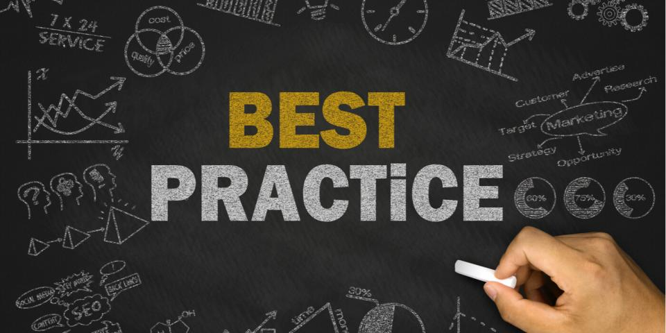

# Best Practices

* [Security By Design](best-practices/security-by-design.md)
* [Business Continuity Disaster Recovery](best-practices/business-continuity-disaster-recovery.md)
* [Automate IT](best-practices/automate-it.md)
* [Infrastructure As Code](best-practices/infrastructure-as-code.md)
* [Cattle Not Pets](best-practices/cattle-not-pets.md)
* [Continuous Integration Deployment](best-practices/continuous-integration-deployment.md)
* [Fight Tech Debt](best-practices/fight-tech-debt.md)
* [Good History Documentation](best-practices/good-history-documentation.md)
* [Prefer Open-source](best-practices/prefer-open-source.md)
* [Leverage Existing Solutions](best-practices/leverage-existing-solutions.md)
* [Avoid Vendor Lock-in](best-practices/avoid-vendor-lock-in.md)
* [Simple Composable Architecture](best-practices/simple-composable-architecture.md)
* [Logging And Monitoring](best-practices/logging-and-monitoring.md)
