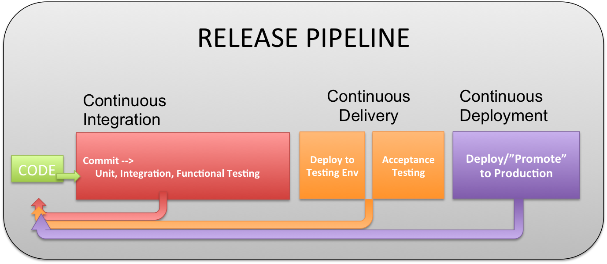

# Continuous Integration Deployment

## Description
An engineering organization will setup CI (and CD where appropriate) pipelines for applications, web and others.

## Rationale
Continuous Integration and Deployment are essential in being able to deliver multiple changes per day into production.  Automating the process of building, testing, releasing and deployment code allows for quick changes and agility.  The tight feedback look as described in the 2ndWay is what allows for rapid change.  Having these systems in place along with good testing and code reviews gives confidence to push changes into production at any time and not having to use off hours and weekends.

## Implication
An engineering organization will have to invest in setting up these systems for all of their software flows.  There is a large cost upfront to setup these system, but afterwards the benefits more than outweigh them.

## Principles
* [Continuous](../design-principles/continuous.md) because this is the essential piece in these pipelines, small iterations continually moving through the system, given instant feedback.
* [Automated](../design-principles/automated.md) because this is prerequisite for the amount of work that each of these systems do when operating on a single change of source code.
* [Collaborative](../design-principles/collaborative.md) because these systems are built for teams of people working together to write better code and delivery products faster.

## References
* https://en.wikipedia.org/wiki/Continuous_integration
* https://en.wikipedia.org/wiki/Continuous_delivery
* https://www.digitalocean.com/community/tutorials/an-introduction-to-continuous-integration-delivery-and-deployment
* https://blog.assembla.com/assemblablog/tabid/12618/bid/92411/continuous-delivery-vs-continuous-deployment-vs-continuous-integration-wait-huh.aspx

## Examples
* Tools such as Jenkins, Travis CI are commonly used when setting up these pipelines.

<[prev](cattle-not-pets.md)|[next](fight-tech-debt.md)>
