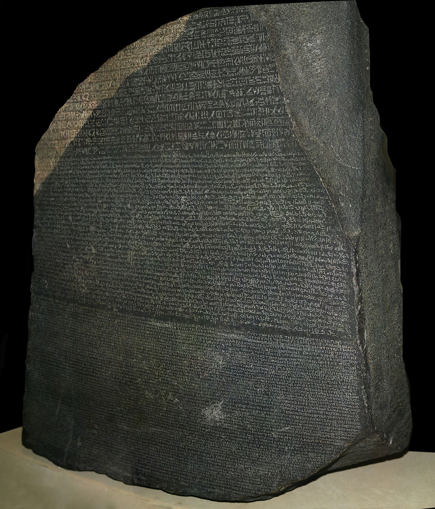

# Good History Documentation

## Description
Engineers should leave good history and documentation via commit message, bug descriptions and comments, and all forms of documentation.

## Rationale
Technical work on systems, or in code can be complex.  It is important to leave a good written history for the next person to understand what has been, what has been changed.  This will promote understanding within the organization, velocity to make future changes, and mitigate risks of making mistakes due to lack of understanding.  Similar care should be given to comments in work tracking tools like Bugzilla, JIRA or Trello.  In addition documentation should be written for any somewhat complex system and kept up to date as the project morphs and changes over time.

## Implication
Mozilla engineers should leave good, detailed commit messages that tell the story of the change.  Sometimes in the course of fixing or developing something a series of poorly crafted commits and messages are created.  These should be cleaned up via rebase prior to being pushed to a public branch like master.

## Principles
* [Readable](../design-principles/readable.md) because good history and documentation is read far more often than it is written and needs to convey meaning quickly and clearly.
* [Collaborative](../design-principles/collaborative.md) because many will read each other's history and documentation and want to understand what matters and what changed and why.

## References
* https://chris.beams.io/posts/git-commit/
* http://www.writethedocs.org/guide/writing/beginners-guide-to-docs/
* http://www.softwaretestinghelp.com/how-to-write-good-bug-report/
* https://en.wikipedia.org/wiki/Rosetta_Stone

## Examples
* Good comments in Bugzilla, Trello, etc.
* Good commit messages in Git, SVN, etc.
* Up to date documentation on a wiki.

<[prev](fight-tech-debt.md)|[next](prefer-open-source.md)>
