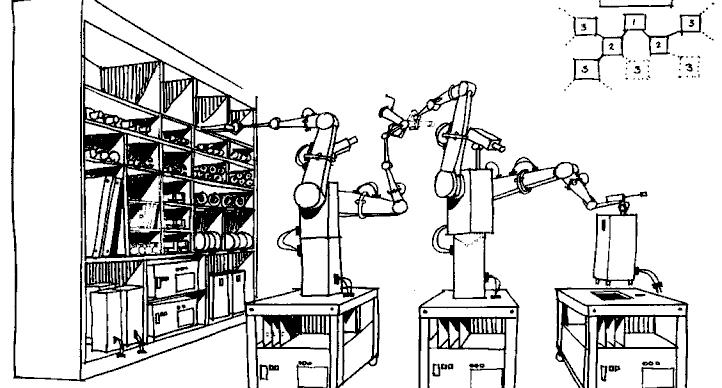

# Infrastructure As Code

## Description
An engineering organization will move a model where all infrastructure is described in code; all code is in source control repositories; all repositories are peer reviewed.

## Rationale
Moving the descriptions of infrastructure design and layout into code allows for the use of mature software development practices to be practiced on operations tasks. Code reviews, automated testing, and CI|CD can all be brought to bear on infrastructure once it is in this form.

## Implication
Wherever possible, An engineering organization will move infrastructure definitions into code and then run them through a mature process with code reviews, automated testing, and CI|CD flows.

## Principles
* [Continuous](../design-principles/continuous.md) because it is code and follows all of the same principles for writing good code: iterative, testing, code reviews, etc
* [Readable](../design-principles/readable.md) because it is much more easy to form a mental model of infrastructure when it is represented in good code.
* [Collaborative](../design-principles/collaborative.md) because infrastructure is shared and will have to be collaborated on.

## References
* Configuration management tools such as: Puppet and Ansible
* Cloud description formats such as: CloudFormation and Terraform

## Examples
* Software Configuration Management tools like CFEngine, Chef, Puppet, Saltstack, and Ansible
* Container orchestration files like Dockerfile or docker-compose.yml, or even ansible-container
* Cloud orchestration files like cloudformation or terraform
* Any software, or script that can be used to manage packages, state, infrastructure, etc

<[prev](automate-it.md)|[next](cattle-not-pets.md)>
