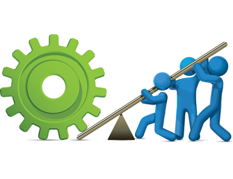

# Leverage Existing Solutions

## Description
An engineering organization will leverage existing solutions, applications, code, etc where possible both from vendors as well as other groups and engineers in the organization.

## Rationale
It is important to provide value to the organization when engineers decide where and how they spend their time.  If an existing solution is available and cost effective it should be considered.  Leveraging existing solutions can also mean finding solutions, or code that currently solves a problem for a team being expanded to solve a slightly different problem for another team.

## Implication
An engineering organization will have to allocate time to research when looking for a possible solution for a particular problem.  This may include some cost analysis for buying a commercial product vs a support estimate for building and supporting something in house.

## Principles
* [Collaborative](../design-principles/collaborative.md) because collaboration with existing solution either within the company or without will be required.

## References
* https://www.ncbi.nlm.nih.gov/pubmed/1456726

## Examples
* Choosing gmail instead of running your own email service

<[prev](prefer-open-source.md)|[next](avoid-vendor-lock-in.md)>
