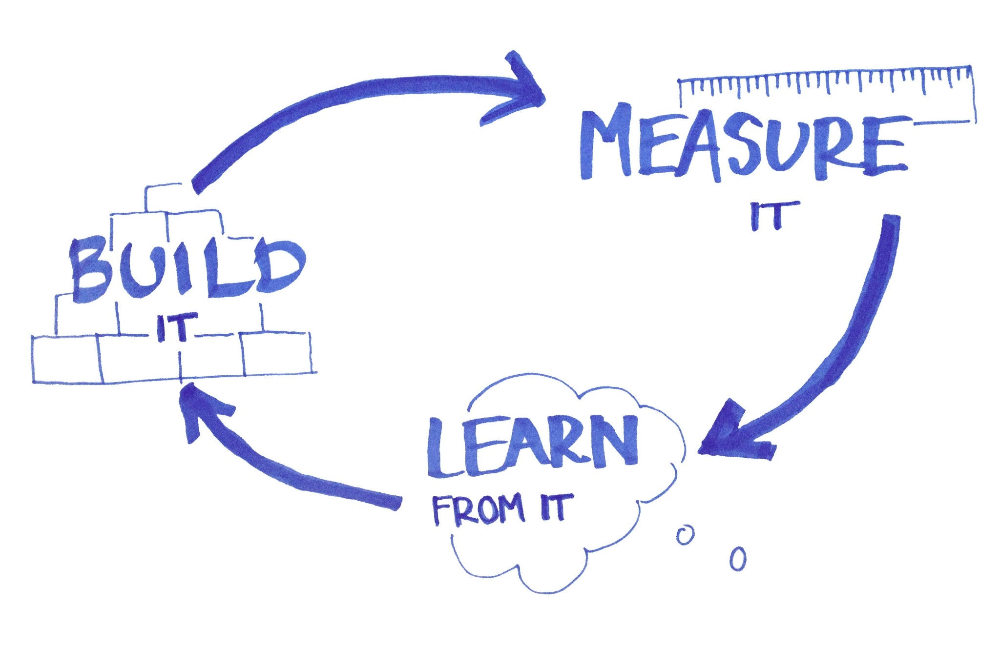

# Continuous

## Description
An organization should embrace continuous change and improvement through an incremental iterative approach.

## Rationale
We need to adapt continuously in the light of changing circumstances (e.g. customer needs, changes in legislation, new technology becomes available).

## Implication
A strong focus is put on continuous improvement to minimize waste, optimize for speed, costs, and ease of delivery, and to continuously improve the products/services offered. Experimentation is therefore an important activity to embed and develop a way of learning from failures is essential. A good rule to live by in that respect is if it hurts, do it more often.

## References
* https://biztechmagazine.com/article/2016/06/kaizen-and-continuous-improvement-through-devops
* https://www.devopsagileskills.org/dasa-devops-principles/
* http://www.upedu.org/references/bestprac/im_bp1.htm

##Examples
* Examples

<[prev](culture.md)|[next](automated.md)>
